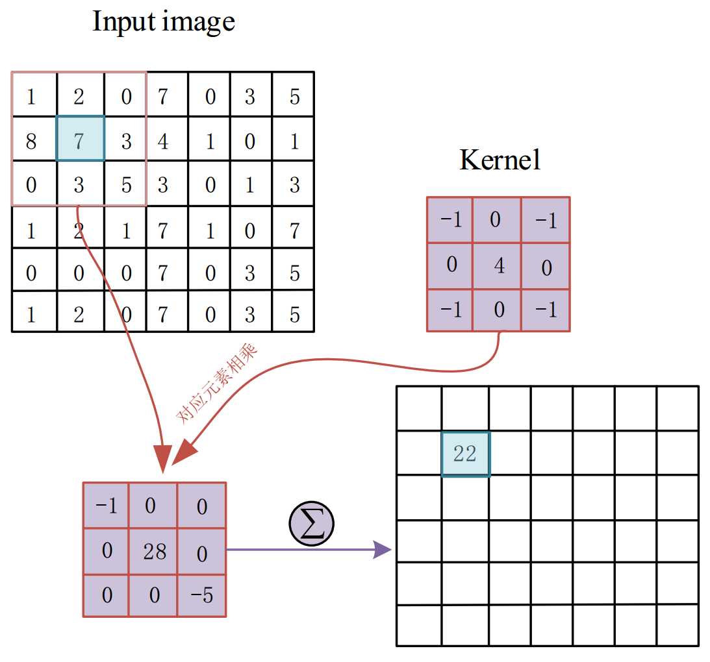
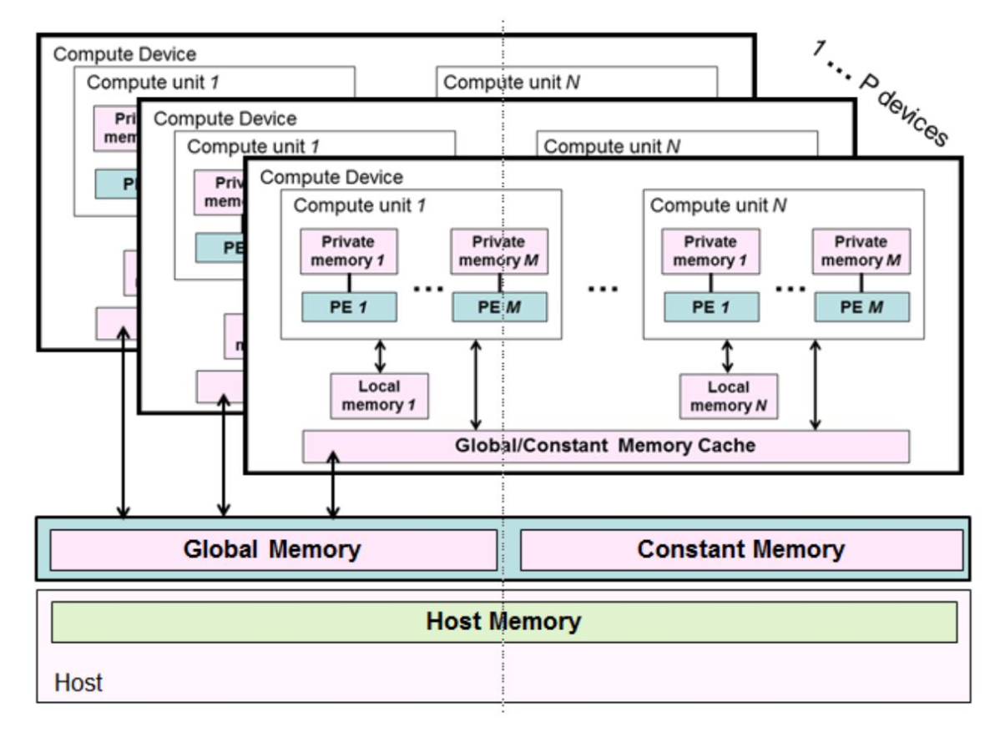
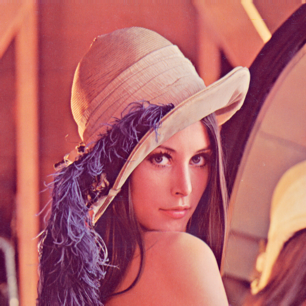
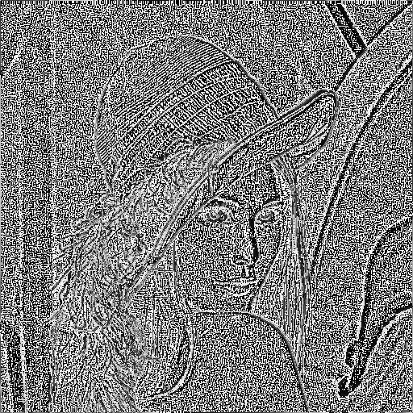
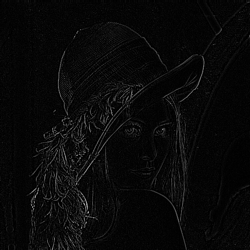
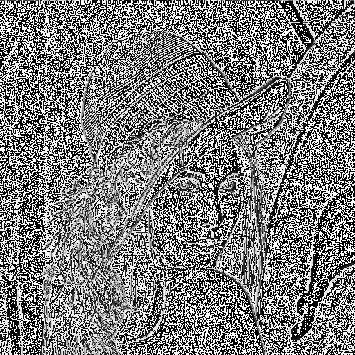
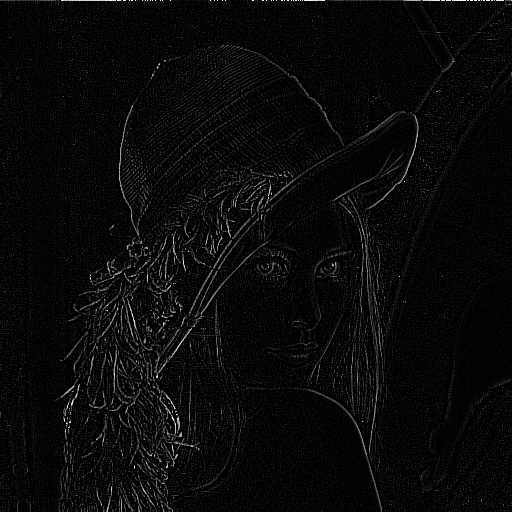
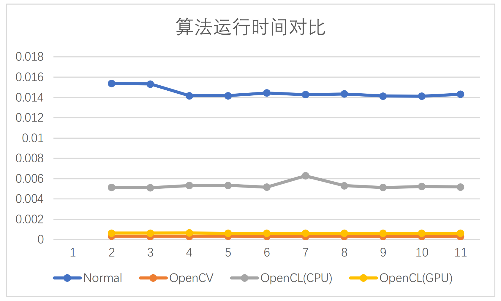

# OpenCL-Image-Filter
  This repository is mainly about how to filter an image in GPU platform
using OpenCL, further more, a comparison with CPU platform and OpenCV
filter2D is studied as well.

## Envoronment
    OpenCL-intel-sdk-1.2
    OpenCV 3.2
    CUDA-9.0/OpenCL
    Inter(R) Corporation Intel(R) Core(TM) i7-4710MQ CPU@2.5GHZ
    NVIDIA Corporation GeForce GTX 850M
## How to Run
    $ git clone git@github.com:ShoupingShan/OpenCL-Image-Filter.git
    $ make clean
    $ make
    $ ./pic

  >**Note**:
  1. If you want change input image, you should not only change the width
        and height in `./pic.cpp` line 12, but also in `./CL/oclFilter.cl` line 8.
  2. Source code in  `./pic.cpp` line 24 where `int gpu = 1` means GPU mode is used and `int gpu = 0` means CPU mode is used resprctively.
## Details
### Image filter process

### OpenCL memory model

### Source Image

## Results
### Normal and OpenCV results
#### 1.Normal Filter

#### 2.OpenCV

### OpenCL_CPU and OpenCL_GPU results
#### 1.OpenCL_CPU

#### 2.OpenCL_GPU

### Run time compare
| `Method`/`Time(/s)`  | Normal  | OpenCV  | OpenCL(CPU)  | OpenCL(GPU)   |
|:--------------------:|:-------:|:-------:|:------------:|:-------------:|
| 1  | 0.015371  | 0.00033 |0.005138 |0.000637 |
| 2  | 0.015318  | 0.000313|0.005108 |0.00064  |
| 3  | 0.01417   | 0.000312|0.005323 |0.000651 |
| 4  | 0.014164  | 0.000331|0.005341 |0.000621 |
| 5  | 0.014439  | 0.000308|0.005168 |0.000623 |
| 6  | 0.014289  | 0.00031 |0.006278 |0.000624 |
| 7  | 0.014349  | 0.000311|0.005307 |0.000625 |
| 8  | 0.014133  | 0.000307|0.00513  |0.000624 |
| 9  | 0.014122  | 0.000315|0.005227 |0.000624 |
|10  | 0.014315  | 0.00033 |0.005174 |0.000629 |
|Average Time/s  | 0.014467| 0.0003145|0.0053194 |0.0006298 |

## Contact me
**Email**: shp395210@outlook.com
