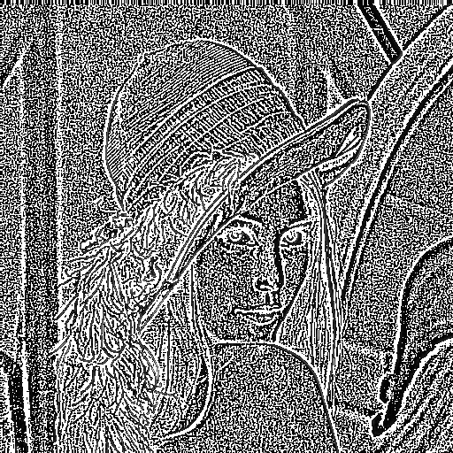

# OpenCL-Image-Filter
  This repository is mainly about how to filter an image in GPU platform
using OpenCL, further more, a comparison with CPU platform and OpenCV
filter2D is studied as well.

## Envoronment
    OpenCL-intel-sdk-1.2
    OpenCV 3.2
    CUDA-9.0/OpenCL
    Inter(R) Corporation Intel(R) Core(TM) i7-4710MQ CPU@2.5GHZ
    NVIDIA Corporation GeForce GTX 850M
## How to Run
Buffer Method
``` shell
$ git clone git@github.com:ShoupingShan/OpenCL-Image-Filter.git
$ cd OpenCL-Image-Filter/src/buffer_method
$ make clean
$ make
$ ./pic
```
Image2D Method
``` shell
$ git clone git@github.com:ShoupingShan/OpenCL-Image-Filter.git
$ cd OpenCL-Image-Filter/src/bimage2D_method
$ make clean
$ make
$ ./pic
```
  >**Note**:
  1. If you want change input image, you should not only change the width
        and height in `./pic.cpp` line 12, but also in `./CL/oclFilter.cl` line 8.
  2. Source code in  `./pic.cpp` line 24 where `int gpu = 1` means GPU mode is used and `int gpu = 0` means CPU mode is used resprctively.
## Details
### Image filter process

### OpenCL memory model

### Source Image

## Results
### Normal and OpenCV results
#### 1.Normal Filter

#### 2.OpenCV


### OpenCL_CPU, OpenCL_GPU and OpenCL_Image2D results
#### 1.OpenCL_CPU

#### 2.OpenCL_GPU

#### 3.OpenCL_Image2D


### Run time compare
| `Method`/`Time(/s)`  | Normal  | OpenCV  | OpenCL(CPU)  | OpenCL(GPU)   |Image2D|
|:--------------------:|:-------:|:-------:|:------------:|:-------------:|:--:|
| 1  | 0.015371  | 0.00033 |0.005138 |0.000637 | 0.000375|
| 2  | 0.015318  | 0.000313|0.005108 |0.00064  |0.000367|
| 3  | 0.01417   | 0.000312|0.005323 |0.000651 |0.000377|
| 4  | 0.014164  | 0.000331|0.005341 |0.000621 |0.00038|
| 5  | 0.014439  | 0.000308|0.005168 |0.000623 |0.00037|
| 6  | 0.014289  | 0.00031 |0.006278 |0.000624 |0.000364|
| 7  | 0.014349  | 0.000311|0.005307 |0.000625 |0.000374|
| 8  | 0.014133  | 0.000307|0.00513  |0.000624 |0.000379|
| 9  | 0.014122  | 0.000315|0.005227 |0.000624 |0.000377|
|10  | 0.014315  | 0.00033 |0.005174 |0.000629 |0.000372|
|Average Time/s  | `0.014467`| `0.0003145`|`0.0053194` |`0.0006298` |`0.000374`|


### Run time changed by image size

| `Method`/`Time(/s)`  | Normal  | OpenCV  | OpenCL(CPU)  | OpenCL(GPU)   | Image2D|
|:--------------------:|:-------:|:-------:|:------------:|:-------------:|:---:|
| 256*256  | 0.003827  | 0.000123 |0.001939 |0.000408 | 0.000351 |
| 512*512  | 0.014761  | 0.0003444|0.005273 |0.000589  | 0.000375|
| 1280*720  | 0.0050005   | 0.001282|0.017817 |0.001345 | 0.000485|
| 1920*1080  | 0.110346  | 0.002831|0.037708 |0.002273 | 0.000926|
| 2560*1440  | 0.195084 | 0.005242|0.06523|0.003523 |0.001367 |
| 2880*2560  | 0.390584  | 0.09822 |0.128243 |0.009293 | 0.0022|
| 3840*2160  | 0.441809  | 0.0118741|0.143425 |0.010045 |0.002367 |
| 7680*4320 | 1.7679  | 0.04676|0.56525  |0.029638 |0.007554 |


### OpenCV & OpenCL_GPU & OpenCL_Image2D

## Contact me
**Email**: shp395210@outlook.com
